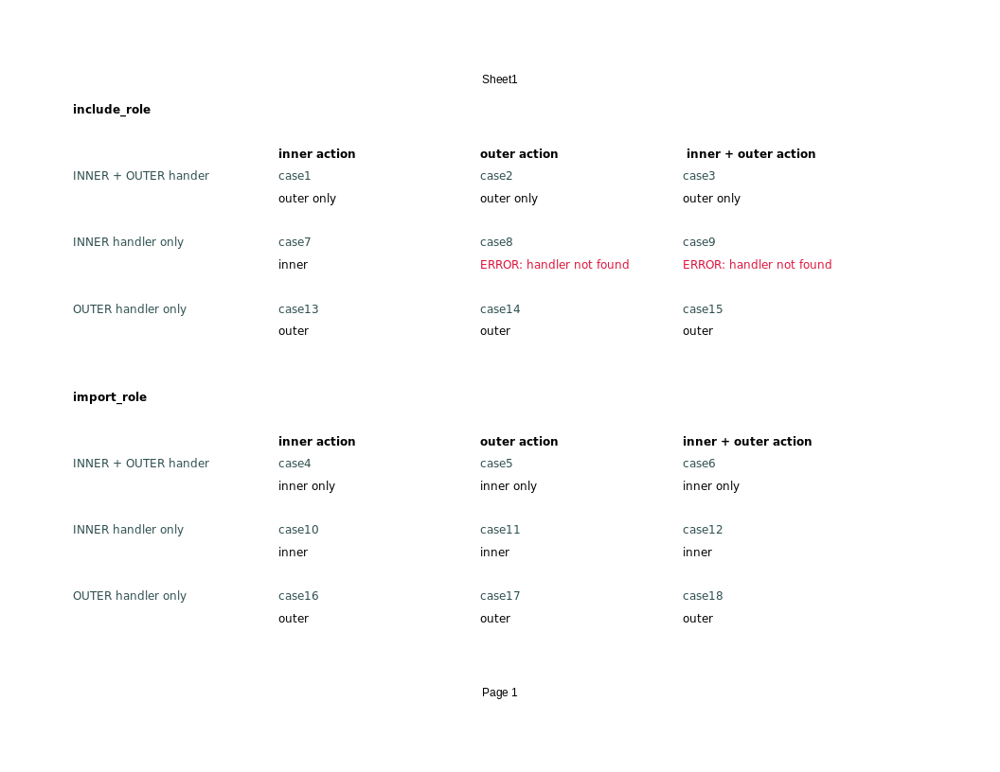

There are 18 cases to study.

There are 6 more (when there are no handlers in any role), but they are trivial and omitted.
Each case is placed in a separate directory

See gnumeric chart for details. template contain bootstrap directory with common part.
To run each case, go to caseN directory and run `ansible-playbook -i localhost, play.yaml`


<br>

### Using `test.sh`

```shell
./test.sh &> output.txt
```

### test result

